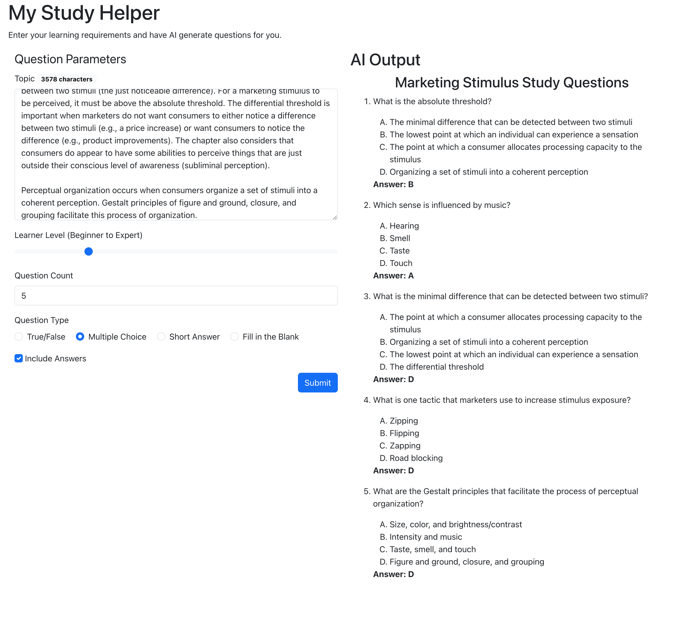

# WEB222 Form + API Example

This example shows how to connect a simple `<form>` to the [OpenAI Chat API](https://platform.openai.com/docs/guides/chat) in the browser.

## Instructions

Install the dependencies:

```sh
npm install
```

Create an [OpenAI Account](https://platform.openai.com/) and get your [Secret API Key](https://help.openai.com/en/articles/4936850-where-do-i-find-my-secret-api-key).

Create a file named `.env` in the root of the project and add your API Key to it.  You can use the `env.example` file to help you:

```sh
cp env.example .env
```

Now edit `.env` and replace the `...` with your API key.

Bundle the code and start a server:

```sh
npm start
```

You can now try the app at `http://localhost:1234`.

## Warning

Do **NOT** put this code on the public internet, since it would [expose your Secret API KEY](https://help.openai.com/en/articles/5112595-best-practices-for-api-key-safety).  It is fine to run it locally, however.

## Example


